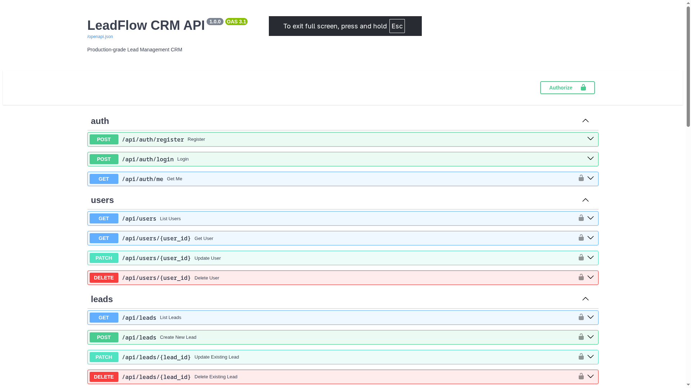
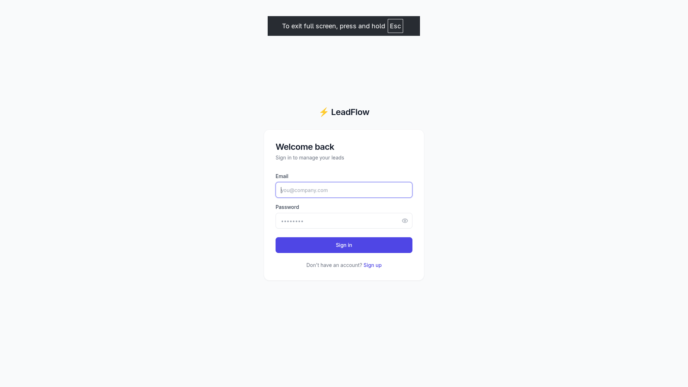
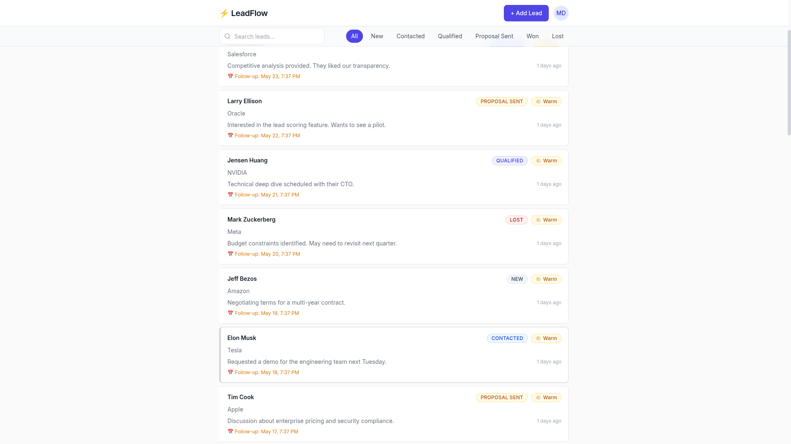

# LeadFlow CRM

LeadFlow is a production-style CRM for sales reps with a complete backend and an upgraded frontend focused on speed, clarity, and AI-assisted workflows.

## What We Built

### Core CRM Experience
- JWT authentication (login/signup/logout)
- Lead list with status filters and search
- Today’s follow-ups section
- Lead timeline dialog with discussion history
- Add lead flow
- Add discussion + optional follow-up datetime
- Lead status updates
- Optimistic updates and overdue highlighting

### AI Features Added (Frontend Integration)

#### 1) Company Enrichment (Add Lead Modal)
- Calls `POST /api/ai/enrich-company`
- User enters company name and clicks **Enrich**
- Shows intelligence card with:
  - company overview
  - industry/size/HQ/website/founded
  - recent news
  - pain points (sales angles)
- Includes loading, error, dismiss, and `ai_available` fallback states

#### 2) AI Lead Intelligence (Lead Dialog)
- **AI Summary** via `POST /api/ai/summarize`
- **AI Score** via `POST /api/ai/score-lead`
  - compact badge on lead cards for scanability
  - detailed score card in dialog with:
    - score meaning
    - backend reasoning
    - recommended action
  - refresh support + cache invalidation
- **AI Suggest Follow-up** via `POST /api/ai/suggest-followup`
  - suggests follow-up time from note text
  - pre-fills follow-up controls when suggestion exists

#### 3) Email Generation (Lead Dialog)
- Calls `POST /api/ai/generate-email`
- Purpose + tone + optional context inputs
- Generated subject/body preview
- Copy subject/body/all actions
- `mailto:` deep-link open
- Robust newline normalization for body formatting (`\n` rendering fixed)
- Handles provider failure/error states gracefully

## Tech Stack

### Frontend
- React 18 + Vite
- TailwindCSS
- Framer Motion
- TanStack React Query v5
- Zustand
- Axios with auth interceptors
- React Router v6
- Lucide icons

### Backend (Already Complete, Not Modified)
- FastAPI
- SQLAlchemy
- PostgreSQL (Supabase)
- JWT auth
- API prefix: `/api`

## Environment Setup

### Frontend `.env`
Create `frontend/.env`:

```env
VITE_API_URL=http://localhost:8000
VITE_DEFAULT_SENDER_EMAIL=
```

### Frontend `.env.example`
Included and commit-safe at `frontend/.env.example`.

## Run Locally

### Backend
```bash
cd backend
pip install -r requirements.txt
uvicorn app.main:app --reload --port 8000
```

### Frontend
```bash
cd frontend
npm install
npm run dev
```

## Media

All screenshots can be placed in `media/`.

### Backend Overview


### Login / Signup


### Lead List + Filters



### Lead Dialog + Timeline


### AI Summary
![AI Summary]


### AI Score Card
![AI Score Card]


### AI Suggest Follow-up
![AI Follow-up Suggestion]


### Email Generator Modal
![Email Generator]


## Notes
- Backend code/contracts were preserved.
- AI errors are non-blocking; core CRM actions continue to work.
- UI additions follow existing Tailwind design language and motion patterns.
